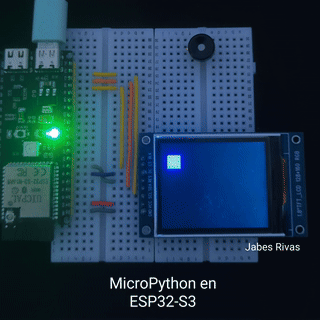

# Hello World en pantalla ST7735 con MicroPython y ESP32-S3
[](https://micropython.org/) [](https://www.espressif.com/en/products/socs/esp32-s3) [](https://opensource.org/licenses/MIT)

## Descripción

Este proyecto demuestra una animación simple de un cuadrado que rebota en los bordes de una pantalla TFT ST7735 de 1.8" (128x160 RGB). El programa está escrito en MicroPython y está diseñado para ejecutarse en un microcontrolador ESP32-S3. Cuando el cuadrado toca un borde, cambia de dirección y de color.

## Hardware Requerido

* **Microcontrolador:** ESP32-S3
* **Pantalla:** TFT ST7735 de 1.8 pulgadas (resolución 128x160, RGB)
* **Cables de conexión** (Jumper wires)

## Software y Librerías

* **Firmware:** [MicroPython](https://micropython.org/) para ESP32-S3.
* **Driver de Pantalla:** `st7735.py` - Un driver de MicroPython para el controlador ST7735. Este proyecto utiliza la versión adaptada por boochow, disponible en:
    * [boochow/MicroPython-ST7735 en GitHub](https://github.com/boochow/MicroPython-ST7735)
    Este archivo `st7735.py` debe estar presente en el sistema de archivos del ESP32-S3.
## Configuración de Pines

El script utiliza la siguiente configuración de pines para la comunicación SPI con la pantalla TFT ST7735:

| Pin Pantalla | Pin ESP32-S3 (GPIO) | Propósito         | Variable en Código |
| :----------- | :------------------ | :---------------- | :----------------- |
| CS           | 10                  | Chip Select       | `PIN_CS`           |
| DC (RS/A0)   | 6                   | Data/Command      | `PIN_DC`           |
| RST          | 7                   | Reset             | `PIN_RST`          |
| SCLK (SCK)   | 12                  | SPI Clock         | `PIN_SCLK`         |
| MOSI (SDA/DIN) | 11                  | SPI Master Out    | `PIN_MOSI`         |
| VCC          | 3.3V                | Alimentación      |                    |
| GND          | GND                 | Tierra            |                    |

**Nota sobre el Bus SPI:**
El script está configurado para usar `SPI_BUS_ID = 2`. En ESP32, esto usualmente corresponde a VSPI. Asegúrate de que los pines `PIN_SCLK` (12) y `PIN_MOSI` (11) sean los correctos para el bus SPI que deseas utilizar en tu placa ESP32-S3 específica.

## Instalación y Uso

1.  **Flashear MicroPython:** Asegúrate de tener el [firmware de MicroPython](https://micropython.org/download/ESP32_GENERIC_S3/) más reciente instalado en tu ESP32-S3:
    ```bash
    python -m esptool erase_flash
    python -m esptool --baud 460800 write_flash 0 ESP32_GENERIC_S3-20250415-v1.25.0.bin
    ```
2.  **Copiar Archivos:**
    * Copia el archivo del driver `st7735.py` a la memoria interna de tu ESP32-S3.
    * Copia `main.py` a la raíz de tu ESP32-S3.
3.  **Conexiones:** Conecta la pantalla TFT ST7735 al ESP32-S3 siguiendo la tabla de configuración de pines de arriba.
4.  **Ejecutar:** Reinicia tu ESP32-S3. El script `main.py` debería ejecutarse automáticamente, mostrando la animación en la pantalla.

## Funcionamiento del Script

* **`setup_display()`**: Esta función inicializa la comunicación SPI con los pines especificados y configura la instancia del controlador de la pantalla TFT.
* **`main()`**:
    * Llama a `setup_display()` para preparar la pantalla.
    * Establece la rotación de la pantalla a modo landscape (160 de ancho x 128 de alto).
    * Define los colores de fondo y del cuadrado.
    * Inicializa la posición y velocidad del cuadrado.
    * Entra en un bucle infinito (`while True`):
        1.  Borra el cuadrado de su posición anterior (dibujándolo con el color de fondo).
        2.  Actualiza las coordenadas `x` e `y` del cuadrado según su velocidad (`dx`, `dy`).
        3.  Verifica si el cuadrado ha colisionado con alguno de los bordes de la pantalla. Si es así, invierte la dirección de movimiento correspondiente (`dx` o `dy`) y cambia el color del cuadrado.
        4.  Dibuja el cuadrado en su nueva posición con el nuevo color.
        5.  Espera un corto período para controlar la velocidad de la animación.